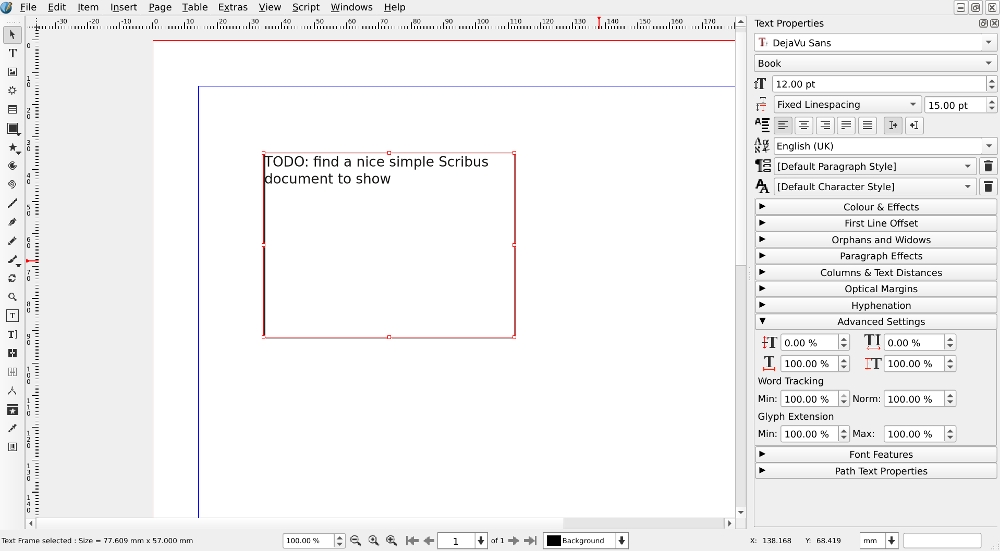
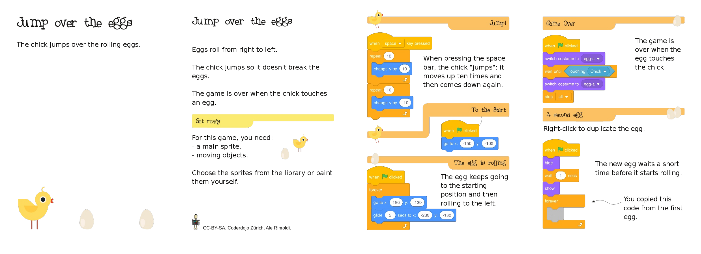

# Evaluating Scribus

TODO: We might need a better title. It's not about learning to use Scribus, but about checking if Scribus fits the reader's needs.

## Introduction

This document started as a reaction to [a post in the Scribus Forum](https://forums.scribus.net/index.php/topic,4778.msg22014.html) complaining about nearly every aspect of Scribus.  

We don't want you to have a similar experience and we want to clarify:

- What is Scribus.
- What Scribus does for you.
- How to get Scribus.
- How to install and configure Scribus.
- Some Scribus fundamentals.

And, finally, we will show you how to do your first steps with Scribus.

Just one last remark, before starting: this document does not teach how to efficiently use Scribus: it just tries to avoid that people get stuck and angry while evaluating it!

## What is Scribus?

Scribus is a Desktop Publishing (DTP) application which lets you create professional page layouts for PDF (Portable Document Format) files.

<!-- <media-tag src="https://files.cryptpad.fr/blob/dd/dddf90c51e3f77c23e2f95a6d942b526b462a84dc44f05dc" data-crypto-key="cryptpad:o1LB5WBGnCKDn2rnn2eh+S+TW03XRDQukQzvWQxlbvQ="></media-tag> -->

If you're unsure about what Desktop Publishing means, Wikipedia has an [exhaustive page about it](https://en.wikipedia.org/wiki/Desktop_publishing).  
Spoiler: Scribus is not a good fit for [typical Word Processor tasks](https://en.wikipedia.org/wiki/Word_processor), on the contrary, it can be the solution when Word Processor Programs are not a good fit.

## What can you do with Scribus?

Typically, ith Scribus you can create

- brochures,
- posters,
- booklets,
- books,
- magazines

<!-- <media-tag src="https://files.cryptpad.fr/blob/be/be7d954659b4954a10fa958a87e2c7733eecd44b4c63ffa4" data-crypto-key="cryptpad:8Nj2SMQTMNrC38nD8yC7KKRmBSLGEfLIcMZQyOqdevM="></media-tag> -->

TODO: add photos of document created with Scribus:

- Le Tigre

Short, Scribus is for producing documents that you plan to print and distribute.  
It is most suitable when the layout and the typography matter

You can also use it for producing PDFs that will be available electronically, but it tends to create rather big files (which you can often process with tools for shrinking the PDF size).

It has a feature-rich interface that lets you create professional-quality output with print functionality that includes support for CMYK and spot colors, color separation, ICC profiles, and printer marks.

## How to get Scribus?

Scribus is completely free -- no trial period and no adverts -- and distributed under the GNU GPL license.

You can get it from the project website: https://www.scribus.net/downloads

Here are the direct links to the most popular downloads for the current version of Scribus (Scribus 1.5.8, from Sourceforge):

- [Scribus 1.5.8 for Windows 64 bit](https://sourceforge.net/projects/scribus/files/scribus-devel/1.5.8/scribus-1.5.8-windows-x64.exe/download)
- [Scribus 1.5.8 for Mac OS](https://sourceforge.net/projects/scribus/files/scribus-devel/1.5.8/scribus-1.5.8.dmg/download)
- [Scribus 1.5.8 Appimage for Linux](https://sourceforge.net/projects/scribus/files/scribus-devel/1.5.8/scribus-1.5.8-linux-x86_64.AppImage/download)

The Scribus team uses Sourceforce to distribute the releases of Scribus.  
On Sourceforge  you can find a few [more options](http://sourceforge.net/projects/scribus/files/scribus-devel/1.5.8/) and [older versions](http://sourceforge.net/projects/scribus/files).

## How to install and configure Scribus

### Linux

For most distributions, Scribus 1.5.8 is packaged in the repositories. Just use the distribution's package manager to get the latest version of Scribus.

If you can't find it there, you can try to use the [Scribus Appimage](https://sourceforge.net/projects/scribus/files/scribus-devel/1.5.8/) from Sourceforge.

### Windows

- Download the install file (see previous chapter)
- Double click on the Installer and follow the instructions.

TODO: add a screenshot

### Mac OS

- Download the install file (see previous chapter)
- Double click on the .dmg file
- open the corresponding virtual disk and move the Scribus application inside of it to the Application folder

TODO: add a small screencast of the last step?

## Some Scribus fundamentals

- Creating a frame
- Writing the text in a frame
- Loading an image in a frame
- Copy paste
- Text Fromatting
  - bold / italic
  - apply a font
  - create and apply a style
  - advanced settings
- Creating a page
- Linking frames
- Adding page numbers
- Producing a PDF

## Aknowledgments

This document is published under a [Creative Common Attribution Share Alike](https://creativecommons.org/licenses/by-sa/4.0/) ([CC-BY-SA](https://creativecommons.org/licenses/by-sa/4.0/)) license.

Its authors are:

- Ale Rimoldi

## Contribute to this tutorial

### Essentials

- This document has a double _home_:
  - https://cryptpad.fr/code/#/3/code/view/f01f7d85c02a35c6eb55661f331ffd0c/
  - <https://github.com/aoloe/scribus-manual-evaluating>
- Everybody can read this document in its latest form.
- If you want to edit this document:
  - On CryptPad:
    - Create an account on PryptPad.
    - Ask in the Scribus community to become a contributor and post there your HedgeDoc username.
  - With Git:
    - Fork <https://github.com/aoloe/scribus-manual-evaluating>,
    - make your changes,
    - trigger a merge request.
- The goal of this document is
  - to convey a rough understanding about Scribus,
  - to be as short as possible,
  - not to be exhaustive.
- We want to have as many translations as possible:
  - The original is in English. If you want to make changes to the content of a translation, please also add it to the English (It can be added as a todo note if you do not feel proficient enough in English.)
  - A copy of this document is in a git repository (<https://github.com/aoloe/scribus-manual-evaluating>) and we publish diffs to help the translators spot the changes.
- We have a list of questions this document aims at answering:
  - Before adding new content (or modifying the existing content), please make sure that your contribution fits one of the questions.
  - If you want do add a new question or modify an existing one, please discuss it first with the other authors (in the Scribus forums)
- Not everybody who contributes has perfect English skills:
  - You're welcome to improve other people's text.
  - If you're not feeling good enough, try to write very simple sentences that are mostly correct. Somebody else can improve them later.
- This document is published under a CC-BY-SA license
- Please behave in a way that is pleasant for the other contributors.

### Questions we want to answer

#### Is Scribus the right tool for me?

#### What is DTP?

#### How do I install Scribus?

- We might want to publish multiple versions of this document, one for each _supported_ platform.

#### How can I do my first steps with Scribus?

- We don't want to teach how to use Scribus
- We only want to show how the user can perform some simple tasks
- Creating text and image frames
- Basic text formatting (bold/italic/size, pick and add fonts, create and apply styles, advanced typographic settings)
- Creating pages, adding page numbers
- Linking frames
- Producing a PDF

- Key features that need a warning:
  - Tables: Creating tables inside of Scribus is cumbersome. In most cases, you should rather use tabs or import the table as PDF from Office.
  - Table of contents: Scribus can create table of contents, but the process is very cumbersome. There is a Python script that can help.
  - Footnotes: you can create footnotes, but the feature is not stable (it might or not work for you)
  - Sharing Scribus documents over the network: it is not possible to _sipmly_ share a Scribus document with other people: it is possible to do so, but you need to go through some additional steps.

#### What I can do if I'm stuck?

- Where is my font?
  - Just explain the basics, do not write a full tutorial

### Users _complaints_

We want to build this document on real user's needs.

Here is a list of complaints people made about Scribus. Let's try to learn from them!

If you find other complaints that you feel can be helpful for improving this document (not to improve Scribus!) please add them to this chapter!

### The original complaint

On December, 7 2023, [abrogard wrote to the Scribus forums](https://forums.scribus.net/index.php/topic,4778.msg22014.html):

First off [Scribus] just looked like MS draw or something.
then I tried pasting in some text. didn't work.
then i opened a text box and tried again. didn't work
then i 'inserted' and a whole file came in.
so then i tried to embolden a heading. 
didn't work.
then i googled and found that won't work. got to select a different font.
now's a good time, I think, for me to get a 'heads up'
what do I want this for?
which software is it an immediate improvement on?  which thing has it 'done better than they do'?
or if you like: which costly software does it do the same as but free?
or which need does it address that currently isn't met?

not arguing with it, you understand? not trying to put it down at all.  just simply trying to get it straight what i'm into here.  so's i don't ask what it perhaps can't deliver and perhaps was never meant to deliver.

Must admit I do very little 'desktop publishing'  mainly I do it when I have to send formatted submissions to my online school.  I find Word and Libre Office often quite bloody annoying there. Improvement on that would be good.

