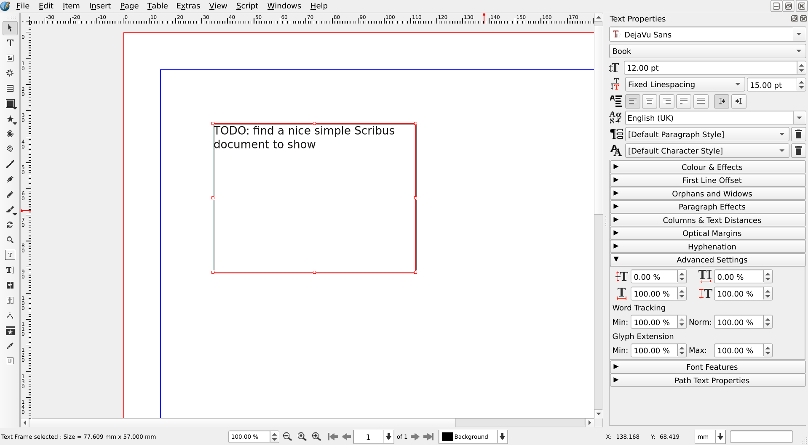
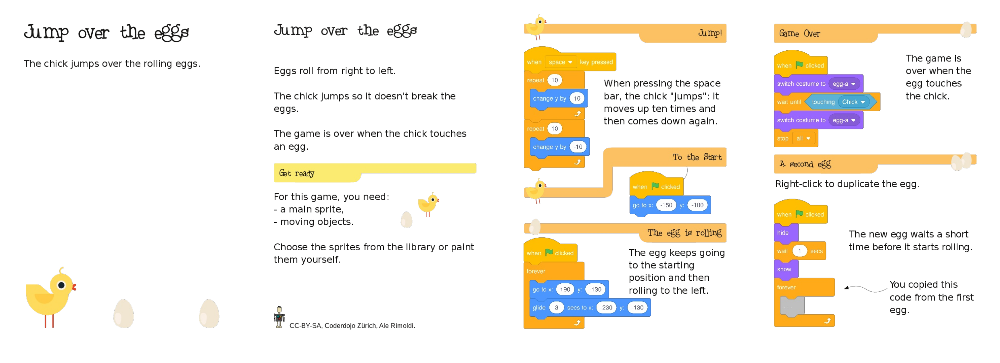

# Evaluating Scribus

## Introduction

TODO: We might need a better title for the document  
It should convey that it's not about learning to use Scribus, but about checking if Scribus fits the reader's needs.
- Discovering Scribus?

TODO: We need a nice cover (and / or a concept for all Scribus manual covers...)

When evaluating a new software, some people are overly enthusiast, others simply can't find the basic things and get frustrated.

This document tries to help both, and clarify what to honestly expect from Scribus and by helping the _cautious_ one in their first steps.

We want you to have a smooth experience, while evaluating Scribus and we will try to make it clear:

- what is Scribus,
- what Scribus can do for you,
- how to get Scribus,
- how to install and configure Scribus,
- some _principles_ behind Scribus

And, finally, we will show you, how to do some first steps.

Just one last remark, before starting: this is not a manual or a tutorial.  
Towards the end of this document, we will give you a list of links to resources that you can use to learn how to use Scribus.

## What is Scribus?

Scribus is a Desktop Publishing (DTP) application for creating professional page layouts and producing PDF files that are ready to be printed at a print shop.

<!-- <media-tag src="https://files.cryptpad.fr/blob/dd/dddf90c51e3f77c23e2f95a6d942b526b462a84dc44f05dc" data-crypto-key="cryptpad:o1LB5WBGnCKDn2rnn2eh+S+TW03XRDQukQzvWQxlbvQ="></media-tag> -->

If you're unsure about what Desktop Publishing means, Wikipedia has an [exhaustive page about it](https://en.wikipedia.org/wiki/Desktop_publishing).  

And what isn't Scribus?

Scribus is not a good fit for [typical Word Processor tasks](https://en.wikipedia.org/wiki/Word_processor), on the contrary, it can be the solution when Word Processor Programs are not a good fit (_floating_ text and images, good typography, color management).

Also, Scribus is not a PDF editor.  
Since it can read PDFs and produce PDFs, depending on your needs, you might be able to abuse it to edit PDFs.

## What can you do with Scribus?

Typically, with Scribus you can create

- brochures,
- posters,
- booklets,
- books,
- magazines

<!-- <media-tag src="https://files.cryptpad.fr/blob/be/be7d954659b4954a10fa958a87e2c7733eecd44b4c63ffa4" data-crypto-key="cryptpad:8Nj2SMQTMNrC38nD8yC7KKRmBSLGEfLIcMZQyOqdevM="></media-tag> -->

TODO: add photos of documents created with Scribus (if possible, we should avoid screenshots):

- Le Tigre

Short, Scribus is for producing documents that you plan to print and distribute.  
It is most suitable when the layout and the typography matter

You can also use it for producing PDFs that will be available electronically, but it tends to create big files (there are tools for shrinking the PDF size, though).

It has a feature-rich interface that lets you create professional-quality output with export functionality that includes support for several PDF versions, CMYK and spot colors, color separation, ICC profiles, and printer marks.

## How to get Scribus?

Scribus is completely free -- no trial period and no ads -- and distributed under the GNU GPL license.

You can get it from the project website: <https://www.scribus.net/downloads>

Here are the direct links to the most popular downloads for the current version of Scribus (Scribus 1.6.4, from Sourceforge):

- [Scribus 1.6 for Windows 64 bit](https://downloads.sourceforge.net/project/scribus/scribus/1.6.4/scribus-1.6.4-windows-x64.exe)
- [Scribus 1.6 for Mac OS](https://downloads.sourceforge.net/project/scribus/scribus/1.6.4/scribus-1.6.4.dmg) / [arm64](https://downloads.sourceforge.net/project/scribus/scribus/1.6.4/scribus-1.6.4-arm64.dmg)
- [Scribus 1.6 Appimage for Linux](https://downloads.sourceforge.net/project/scribus/scribus/1.6.4/scribus-1.6.4-linux-x86_64.AppImage)

The Scribus team uses Sourceforce to distribute the releases of Scribus.  
On Sourceforge  you can find a few [more options](https://sourceforge.net/projects/scribus/files/scribus/1.6.4/) and [older versions](http://sourceforge.net/projects/scribus/files).

## How to install Scribus

### Linux

For most distributions, Scribus 1.5.8 is in the official repositories: Just use the distribution's package manager to get the latest version of Scribus.

If you can't find it there, you can try the [Scribus Appimage](https://downloads.sourceforge.net/project/scribus/scribus/1.6.4/scribus-1.6.4-linux-x86_64.AppImage) from Sourceforge.

### Windows

- Download the install file (see the previous chapter)
- Double click on the Installer and follow the instructions.
- Start Scribus from the "Start menu"

TODO: add a screenshot?

### Mac OS

- Download the install file (see the previous chapter)
- Double click on the .dmg file
- open the corresponding virtual disk and move the Scribus application inside of it to the Application folder

TODO: add a small .gif screencast of the last step?

## The Scribus basics

TODO: this chapter is just a list of topics

Scribus is about control:

- You need to add a frame, when you want to add some text.
- When your document gets longer, you need to add a page, 
- If you want some bold text, you need to specify the exact font style of the font family.
- You can't simply pick a _nice_ color, you have to define it, often according to some visual identity document.

### Configuring Scribus

- Docking the properties and content palettes to the right
- Moving the Tools toolbar to the left (and maybe hide the other palettes)
- Media keys vs. fn keys:
  - [How to use the function keys on your Mac](https://support.apple.com/en-us/102439)

### Working with frames

- Creating a text frame
- Writing the text in a frame
- Copy paste
- Linking frames
- Creating an image frame
- Loading an image in a frame
- Resizing the image to fit the frame (automatic, short manual)

### The document size

- By default it creates only one page
- Adding a page

### Formatting the text

- Text Formatting
  - bold / italic
  - apply a font
  - create and apply a style
  - advanced settings
- Adding a color
- Adding page numbers

### Output

- Producing a PDF

### The next steps

- How to learn Scribus: links to other resources

## "Popular" Shortcomings

In Scribus, a few features are not at the level users would expect. It's up to you to judge, if they are deal breaker or not.

- _Tables_: Creating tables inside of Scribus is cumbersome. In most cases, you should rather use tabs or import the table as PDF from Office.
- _Table of contents_: Scribus can create table of contents, but the process is very cumbersome. A Python script exist that can create a table of contents based on paragraph styles.
- _Footnotes_: you can create footnotes, but the feature is not stable (it might or not work for you)
- _Sharing_ Scribus documents:
  - It is not possible to _simply_ put a Scribus document on a shared device and get multiple people to work on it on different computers.
  - The same applies to document on a removable device.
  - And when you send a document to somebody else you have to be a bit careful (you cannot simply send the .sla file)
- _Proofreading_ should be done before importing the text into Scribus.
- Many _Print shops_ do not know anything about Scribus: if something fails, they will blame you and your Scribus.

## Aknowledgments{.page-break}

Everybody is welcome to contribute to this document. Please see to our [Github repository](https://github.com/aoloe/scribus-manual-evaluating) (<https://github.com/aoloe/scribus-manual-evaluating>) and more specifically the [CONTRIBUTE.md](https://github.com/aoloe/scribus-manual-evaluating/blob/main/CONTRIBUTE.md) document for details.

This document is published under a [Creative Common Attribution Share Alike](https://creativecommons.org/licenses/by-sa/4.0/) ([CC-BY-SA](https://creativecommons.org/licenses/by-sa/4.0/)) license.

The authors are:

- Ale Rimoldi

{ width=7em }

:::{.page-break}
---
:::

Finally, we're very grateful to abrogard, who accidentally initiated this document 
with a [post to the Scribus Forums](https://forums.scribus.net/index.php/topic,4778.msg22014.html), where he complained about nearly every aspect of Scribus:

> First off [Scribus] just looked like MS draw or something.
> then I tried pasting in some text. didn't work.
> then i opened a text box and tried again. didn't work
> then i 'inserted' and a whole file came in.
> so then i tried to embolden a heading. 
> didn't work.
> then i googled and found that won't work. got to select a different font.
> now's a good time, I think, for me to get a 'heads up'
> what do I want this for?
> which software is it an immediate improvement on?  which thing has it 'done better than they do'?
> or if you like: which costly software does it do the same as but free?
> or which need does it address that currently isn't met?
> 
> not arguing with it, you understand? not trying to put it down at all.  just simply trying to get it straight what i'm into here.  so's i don't ask what it perhaps can't deliver and perhaps was never meant to deliver.
> 
> Must admit I do very little 'desktop publishing'  mainly I do it when I have to send formatted submissions to my online school.  I find Word and Libre Office often quite bloody annoying there. Improvement on that would be good.
